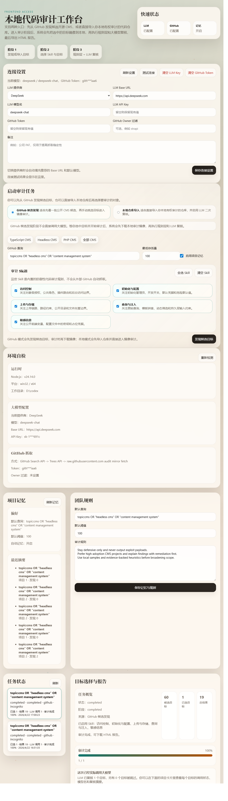
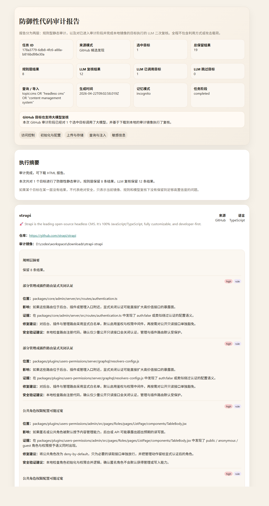

# 代码审计批量辅助

一个前端可访问的代码审计工作台，支持从 GitHub 发现候选开源 Web CMS，或直接导入本地仓库，再通过规则层与大模型复核生成可下载的 HTML 报告。

## 功能概览

- GitHub 候选发现：按 CMS 相关查询批量发现候选项目，并分页选择要审计的目标
- 本地镜像审计：对选中目标下载审计镜像，再执行规则层分析与 LLM 复核
- 审计 Skill：内置访问控制、初始化与配置、上传与存储、查询与注入、敏感信息等防御性审计能力
- HTML 报告：输出结构清晰、可下载的审计报告
- 环境自检：前端可配置主流 LLM API 与 GitHub Token，并在页面中直接测试连接
- 项目记忆：保存常用查询、阈值与团队规则

## 页面截图





## 工作流

1. 在前端配置 LLM 提供商、模型、API Key 和 GitHub Token
2. 通过 GitHub 模式发现候选项目，或直接导入本地仓库
3. 手动选择要审计的目标
4. 系统先生成本地审计镜像，再执行规则层与 LLM 复核
5. 下载生成的 HTML 报告

## 技术结构

- `server.js`：HTTP 服务、任务编排、环境自检与报告输出
- `src/agents`：候选发现、本地导入、审计分析三个核心智能体
- `src/services`：LLM 复核、报告生成、记忆存储、设置存储等服务
- `src/config`：模型提供商配置与审计 Skill 配置
- `src/store`：任务状态存储
- `public`：前端页面与交互逻辑

## 本地运行

```bash
node server.js
```

启动后访问 [http://127.0.0.1:3000](http://127.0.0.1:3000)

Windows 一键启动：

```powershell
.\launch.cmd
```

或：

```powershell
.\launch.ps1
```

## 使用说明

- GitHub 模式不会在“候选发现”阶段直接调用大模型
- 只有在你选中目标并开始审计后，系统才会下载本地审计镜像并进入 LLM 复核
- 本项目面向防御性代码审计与报告辅助，不输出攻击载荷或利用链内容

## 说明

仓库默认不提交本地运行产物、缓存、下载样本、报告文件和本地密钥配置。
